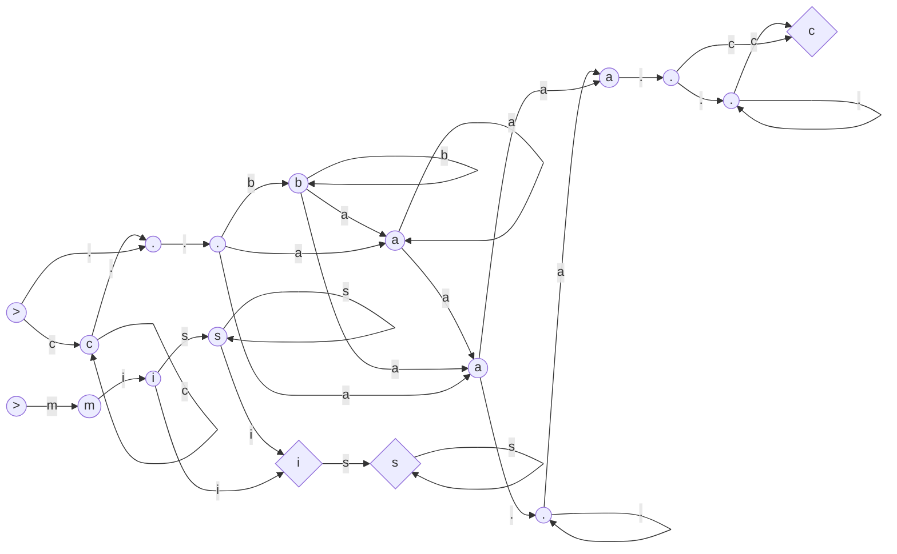
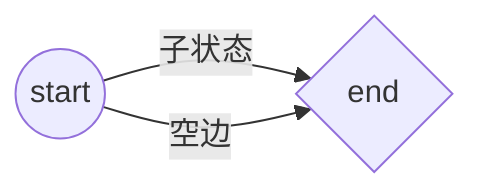
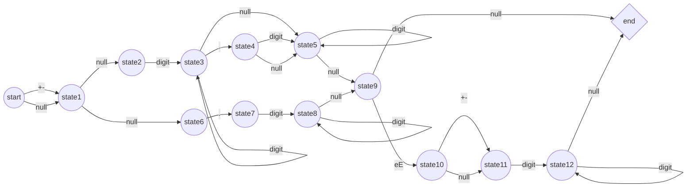
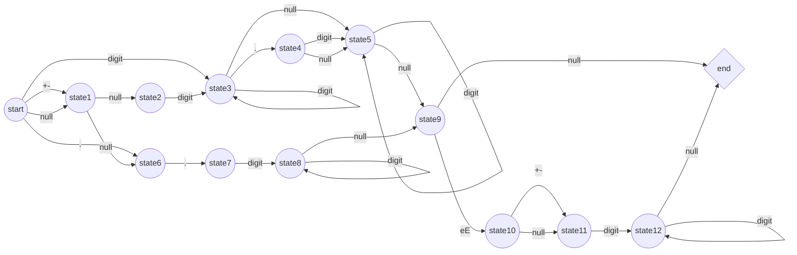
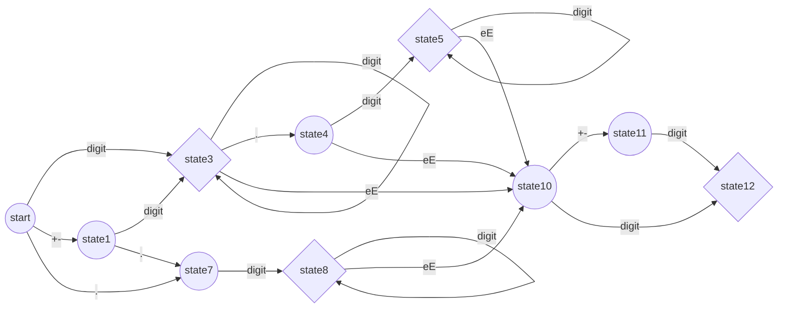

<center><h1>字符串正则匹配的动态规划与编译原理思路

<center>KimanYang
    <center>jinmanyang2016@gmail.com

## 题目引入

下面两道力扣题目分别代表了两种不同类型的状态机，第一种是正则表达式到$NFA$到$DFA$的转换，第二种是正则表达式到$\epsilon-NFA$到$DFA$的转换，选取这两道可以对状态机的设计有更深刻的认识（面试必不会考但是自己写正则引擎总得会一点）。

### 10.正则表达式匹配（hard)

给你一个字符串 s 和一个字符规律 p，请你来实现一个支持 '.' 和 '*' 的正则表达式匹配。

- `.`匹配任意单个字符
- `*`匹配零个或多个前面的那一个元素

所谓匹配，是要涵盖 整个 字符串 s的，而不是部分字符串。

### 44.通配符匹配(hard)

给定一个字符串 (s) 和一个字符模式 (p) ，实现一个支持 `?` 和 `*` 的通配符匹配。

- `?` 可以匹配任何单个字符。
- `*` 可以匹配任意字符串（包括空字符串）。

两个字符串完全匹配才算匹配成功。

说明:

- `s` 可能为空，且只包含从 `a-z` 的小写字母。
- `p` 可能为空，且只包含从 `a-z` 的小写字母，以及字符 `?` 和`*`。

## 动态规划解法

### 10.正则表达式匹配（hard)

字符串匹配问题通常都可以看成是二维动态规划问题，类似的题型包括子序列匹配之类的。用$dp[i][j]$表示$s$中前$i$个字符能否和$p$中前$j$个字符匹配。在进行状态转移时，考虑$p$的第$j$个字符匹配情况：

- 如果$p$的第$j$个字符是一个小写字母，那么我们必须在$s$中匹配一个相同的小写字母，即：
  $$
  dp[i][j]=
  \left\{
  \begin{aligned}
  &dp[i-1][j-1],&s[i]=p[j] \\
  &false,&s[i]\ne p[j]
  \end{aligned}
  \right.
  \notag
  $$
  如果$p$的第$i$个字符与$p$的第$j$个字符不相同，那么无法进行匹配；否则我们可以匹配两个字符串的最后一个字符，

- 如果$p$的第$j$个字符是$*$，那么可以对$p$的第$j-1$个字符进行0到任意次数匹配。进一步想，字母与星号的组合在匹配过程中只会出现两种情况：

  - 匹配$s$最末字符，使用该组合继续匹配
  - 不进行匹配，丢弃该组合

  由此可以写出模式串为$*$时的如下的状态转移方程：
  $$
  dp[i][j]=
  \left\{
  \begin{aligned}
  &dp[i-1][j]\or dp[i][j-2],&s[i]=p[j-1] \\
  &dp[i][j-2],&s[i]\ne p[j-1]
  \end{aligned}
  \right.
  \notag
  $$

- 最后只要遇到是$.$则可以成功匹配

总结上述的三点可以获得如下的状态转移方程：
$$
dp[i][j]=
\left\{
\begin{aligned}
&p[j]\ne '*'=
\left\{\begin{aligned}
&dp[i-1][j-1],&match(s[i-1],p[j-1])\\
&false,	&otherwise
\end{aligned}\right.\\
&otherwise=
\left\{\begin{aligned}
&dp[i-1][j]\or dp[i][j-2],&matches(s[i-1],p[j-2]) \\
&dp[i][j-2],&otherwise
\end{aligned}\right.
\end{aligned}
\right.
\notag
$$
其中$match(x,y)$判断二者是否匹配，只有$y$是`.`或者$x=y$时两个字符匹配。

代码实现如下：

```c++
class Solution {
    public:
    bool isMatch(string s, string p) {
        int m = s.size(), n = p.size();
        auto match = [&](int i, int j) {
            if(i == 0) return false;
            if(p[j-1] == '.') return true;
            return s[i-1]=p[j-1];
        };
        
        vector<vector<int>> dp(m + 1, vector<int>(n + 1));
    	dp[0][0]=1;
    	for(int i = 0;i <= m;++i) {
            for(int j = 1;j <= n;++j) {
                if(p[j-1] == '*') {
                    dp[i][j] |= dp[i][j-2];
                    if(matches(i,j-1)) {
                        dp[i][j] |= dp[i-1][j];
                    }
                } else {
                    if(matches(i,j)) {
                        dp[i][j] |= dp[i-1][j-1];
                    }
                }
            }
        }
        return dp[m][n]
    }
}
```

### 44.通配符匹配(hard)

模仿上述题目，我们分析题目要求的状态转移方程：

用$dp[i][j]$表示$s$中前$i$个字符能否和$p$中前$j$个字符匹配。

当$s[i-1]$和$p[j-1]$匹配且$p[j-1]$不为通配符时，$dp[i][j]$能否成功匹配取决于$dp[i-1][j-1]$能否成功匹配。

当$p[j-1]$为通配符`*`时

- 要么和$s$末尾匹配，取决于$dp[i-1][j-1]$是否成功匹配
- 要么不匹配，取决于$dp[i-1][j]$是否成功匹配
- 如果$dp[i][j-1]$能匹配，那带`*`的$dp[i][j]$也能继续匹配

边界条件$dp[0][0]=true$写出状态转移方程：
$$
dp[i][j]=
\left\{\begin{aligned}
&p[j-1]\ne'*',s[i-1]\Leftrightarrow p[j-1]\implies dp[i][j]=dp[i-1][j-1] \\
&p[j-1]='*'\implies dp[i][j]=dp[i][j-1]||dp[i-1][j]||dp[i][j-1]
\end{aligned}\right.
\notag
$$

```C++
class Solution {
public:
    bool isMatch(string s, string p) {
        int m = s.size(), n = p.size();
        vector<vector<bool>> dp(m + 1, vector<bool>(n + 1));
        dp[0][0] = true;
        for(int i = 0;i <= m;++i) {
            for(int j = 1;j <= n;++j) {
                if(i > 0 && (s[i-1] == p[j-1] || p[j-1] == '?')) {
                    dp[i][j] = dp[i-1][j-1];
                } else if(p[j-1] == '*') {
                   dp[i][j] = dp[i][j] || dp[i][j-1];
                   if(i > 0) dp[i][j] = dp[i][j] || dp[i-1][j-1];
                   if(i > 0) dp[i][j] = dp[i][j] || dp[i-1][j];
                }
            }
        }
        return dp[m][n];
    }
};
```


## 非确定有限状态自动机解法

```Go
/*用于构造NFA图的节点结构*/
type Node struct {
	C        byte             //当前节点接受的字符
	Parent   *Node            //正向生成时的母节点，用于生成自由长度0节点的可跨越边
	Children map[byte][]*Node //子节点个数，一个字节可以对应多个索引（NFA）
	End      bool             //是否为终止节点
	Size     int              //节点长度，如果携带的是*则长度为0，否则为1（只能匹配一个）
}
/*
	核心功能实现，递归生成NFA
	函数签名：
	@param: now 当前要递归生成的节点的根
  	@param: str 模式串，递归中无修改
	@param: idx	当前匹配的坐标,是now要生成节点对应的字符
*/
func generatePattern(now *Node, str string, idx int) int {
	//到达当前末尾
	if len(str) <= idx {
		now.End = true
		return now.Size
	}
	vnow := now //用于下一次更新的节点
	switch str[idx] {
	case '*':
		now.Size = 0              //无限匹配自由长度为0
		now.addVertex(now.C, now) //自己可以接受自己
	default:
		node := new(Node) //创建下一字符节点
		node.C = str[idx]
		now.addVertex(str[idx], node) //当前字符节点后继添加
		node.Parent = now             //当前节点父节点设为node
		node.Size = 1                 //节点自由长度为1
		vnow = node                   //当前节点可以更新为新的节点
	}
	//如果是*则不用创建新节点
	ret := generatePattern(vnow, str, idx+1)
	//后续已无节点（或者只有x*匹配),则当前节点也可作为终止态
	if ret == 0 {
		now.End = true
	}
	//给当前的后继节点配野爹
	addParent := now
	for addParent.Parent != nil {
		//对于正常节点,vnow是我的后继，如果当前节点的长度为零，那我的后继也是我父母节点的后继
		if addParent.Size == 0 {
			//debug(toString(vnow), " -> ", toString(addParent.Parent))
			addParent.Parent.addVertex(vnow.C, vnow) //父母添加一条到我后继节点的边
			addParent = addParent.Parent             //递归匹配到
		} else {
			break
		}
	}
	return now.Size + ret
}

/*为节点n添加一条经由c到达child的边，回溯时会进行新的创建*/
func (n *Node) addVertex(c byte, child *Node) {
	m := n.Children
	//没有后继列表就创建一个
	if m == nil {
		m = make(map[byte][]*Node)
		n.Children = m
	}
	list := m[c]
	//当前字符不存在就创建一个
	if list == nil {
		list = make([]*Node, 0)
	}
	//遍历当前的可达状态，如果存在目标状态则退出
	for _, v := range list {
		if v == child {
			m[c] = list
			return
		}
	}
	//状态不存在，更新列表
	list = append(list, child)
	m[c] = list
}

//递归检查是否能够匹配
func check(now *Node, str string, idx int) bool {
	if len(str) <= idx {
		return now.End
	}
	list := now.Children['.']
	for _, v := range now.Children[str[idx]] {
		list = append(list, v)
	}
	for _, v := range list {
		r := check(v, str, idx+1)
		if r {
			return true
		}
	}
	return false
}

//使用示例，判断s是否能被接受
func isMatch(s string, p string) bool {
	begin := new(Node) //创建start节点
	begin.C = '>'
	begin.Size = generatePattern(begin, p, 0) //递归构造模式串有穷状态自动机
	return check(begin, s, 0)
}
```

所构造的$NFA$图片：

状态机分别为`c*..b*a*a.*a..*c`和`mis*is*`



上述Go代码的C++版本：

```C++
class NFAnode{
    public:
        char ch;
        NFAnode* parent;
        unordered_map<char,vector<NFAnode*>> children;
        bool isEnd;
        int size;
        void addVertex(char ch, NFAnode* child) {
            auto& m = this->children;
            auto& list = m[ch];
            for(auto& v:list) {
                if(v == child) {
                    m[ch] = list;
                    return;
                }
            }
            list.push_back(child);
            m[ch] = list;
        }
};
class Solution {
private:
public:
    bool isMatch(string s, string p) {
        NFAnode* begin = new NFAnode();
        begin->ch = '@';
        begin->size = genneratePatern(begin,p,0);
        return checkHelper(begin,s,0);
    }
    int genneratePatern(NFAnode* now, string str,int idx) {
        if(str.length() <= idx) {
            now->isEnd = true;
            return now->size;
        }
        NFAnode* vnow = now;
        if(str[idx] == '*') {
            now->size = 0;
            now->addVertex(now->ch,now);
        } else {
            NFAnode* node = new NFAnode();
            node->ch = str[idx];
            now->addVertex(str[idx],node);
            node->parent = now;
            node->size = 1;
            vnow = node;
        }
        int ret = genneratePatern(vnow, str, idx + 1);
        if(ret == 0) {
            now->isEnd = true;
        }
        NFAnode* addParent = now;
        while(addParent->parent != nullptr) {
            if(addParent->size == 0) {
                addParent->parent->addVertex(vnow->ch,vnow);
                addParent = addParent->parent;
            } else {
                break;
            }
        }
        return now->size + ret;
    }
    bool checkHelper(NFAnode* now, string str, int idx) {
        if(str.length() <= idx) {
            return now->isEnd;
        }
        auto list = now->children['.'];
        for(auto& v:now->children[str[idx]]) {
            list.push_back(v);
        }
        for(auto& v:list) {
            bool r = checkHelper(v,str,idx+1);
            if(r) {return true;}
        }
        return false;
    }
};
```

读者们如果无法理解代码也没有关系，下一篇文章会详细讨论递归下降构造词法树到最终进行状态机匹配的过程。

## 从正则到$\epsilon-NFA$或者$NFA$到$DFA$转换

罗列知识可能比较难以理解，我们先直观地从简单的题目开始一步一步展示算法实现的过程。

### 状态机经典题目——65.有效数字

有效数字（按顺序）可以分成以下几个部分：

1. 一个 小数 或者 整数
2. （可选）一个 'e' 或 'E' ，后面跟着一个 整数

小数（按顺序）可以分成以下几个部分：

1. （可选）一个符号字符（'+' 或 '-'）

2. 下述格式之一：
   1. 至少一位数字，后面跟着一个点 '.'
   2. 至少一位数字，后面跟着一个点 '.' ，后面再跟着至少一位数字
   3. 一个点 '.' ，后面跟着至少一位数字

整数（按顺序）可以分成以下几个部分：

1. （可选）一个符号字符（'+' 或 '-'）
2. 至少一位数字

给定一个字符串$s$，判断是否为有效数字字符串。

### 正则表达式解法：

显然问题可以直接由正则表达式解决，首先将规则构造为正则表达式也有利于我们进一步的状态机分析。

代码如下：

```C++
const regex Solution::pattern("[+-]?(?:\\d+\\.?\\d*|\\.\\d+)(?:[Ee][+-]?\\d+)?");
class Solution {
public:
    static const regex pattern;
    bool isNumber(string str) {
        return regex_match(str, pattern);
    }
};
```

分析上述的表达式：

- 一个整数的正则表达：`[+-]?\\d+`
- 一个小数的正则表达:`[+-]?((\\d+\\.)|(\\d+\\.\\d+)|(\\.\\d+))`
- 组合起来再带上可选的`e`和`E`:`(小数|整数)[eE]整数`

展开来便是`([+-]?\\d+)|([+-]?((\\d+\\.)|(\\d+\\.\\d+)|(\\.\\d+)))([eE][+-]?)\\d+`

需要注意C++的字符串中添加双斜杠`\\`是为了转义第二个斜杠，实际内存中还是一个`\`，即`\\d`表示标准正则语法中的`\d`。（两层套娃）

正则化简从$DFA$化简的角度理解会更容易一些，也可以给出一些普适的结合律交换律来化简。这里先给出上述正则的简化表达，这也是一部分题解中给出的正则表达式：

```perl
([+-]?(\\d+(\\.\\d*)?|(\\.\\d+)))([eE][+-]?\\d+)?
```

### 从正则到$\epsilon-NFA$

我们将上述抽象的正则表达式一步一步转换为状态机模型，这里的算法被称为Thompson算法。

首先我们确定正则表达式中的字符集，对于我们要进行解析的这个正则表达式来说，字符集为`[+-.deE]`。

其次我们分析正则表达式中的构造方法，并将其对应到$\epsilon-NFA$中。五种构造方法分别为：

1. 字符集接受，即一个规则集合，比如`[+-]`和小括号内的所有内容：

   ```mermaid
   graph LR;
   st((start));
   en{end};
   st -- 字符集 --> en;
   ```

2. 规则的串联，即正则表达式中两个规则直接链接构造的新规则

   ```mermaid
   graph LR;
   st1((start));
   en1{end};
   st2((start));
   en2{end};
   st1 -- 字符集1 --> en1;
   en1 -- 空边 --> st2;
   st2 -- 字符集2 --> en2;
   ```

3. 规则的并联，即正则表达式中两个或以上规则以`|`链接

   ```mermaid
   graph LR;
   st((start));
   en{end};
   st1((start));
   en1{end};
   st2((start));
   en2{end};
   st3((start));
   en3{end};
   st -- 空边 --> st1;
   st -- 空边 --> st2;
   st -- 空边 --> st3;
   st1 --字符集1 -->en1;
   st2 --字符集2 -->en2;
   st3 --字符集3 -->en3;
   en1 --空边-->en;
   en2 --空边-->en;
   en3 --空边-->en;
   ```

4. 规则的重复（1次及以上），即正则表达式中的`X+`一个或以上匹配，为了后续分析方便采用复制状态的表示：

   ```mermaid
   graph LR;
   st((start));
   en{end};
   st1((start));
   en1{end};
   st --子状态1--> en;
   en --空边--> st1;
   st1 --子状态1--> en1;
   en1 --空边-->en;
   ```

5. 规则的可选，即正则表达式中的`X?`,只需要将起始状态和终止状态相连接。



对于4的特殊情况`X*`匹配零次及以上，则直接令`end`同时拥有起始和终止两个状态即可。至此我们根据已有的知识构造题目正则表达式所对应的$\epsilon-NFA$，空边用null表示则有：



出于展示简便没有完全按照上述的形式得出上图展示的$\epsilon-NFA$的模型，做了一些较为直观的冗余空边化简。

### $\epsilon-NFA$的非确定性消除

非确定性的消除主要有两点：1.消除空边 2. 将$NFA$转换为$DFA$。

#### 消除空边

不作证明地给出以下的算法过程：

1. *找到所有的有效状态*

   有效状态指**存在非$\epsilon$(空)边输入的状态**。同时起始状态也是有效状态，另外如果一个状态可以通过空边到达结束状态，那么该状态也应该变成结束状态。在我们的例子中，有效状态有状态1、状态3、状态7、状态4、状态8、状态5、状态10、状态11和状态12。状态5、8和12应该被标记为结束状态。

2. *添加必要的边*

   这一步为核心算法。我们针对每一个有效状态实行如下算法：

   - 寻找该状态的**$\epsilon$闭包**，一个状态的$\epsilon$闭包指的是：**从该状态出发仅仅通过$\epsilon$边能够到达的所有状态**。
   - 将所有从这个闭包中输出的边的出发点全部**复制**到当前状态上。

我们以初始节点为例实施该算法，可以看到初始节点通过空边能够到达的状态包括状态1、2和6。实施算法后的图变为：



对所有的有效状态实施该算法后，最后我们需要**删除所有无效状态和空边**。算法应用的结果如下：



注意到我们将状态3、5、8和12标记为结束状态，而最终的结束状态作为无效状态清除。

这个算法实际上就是我们在之前的正则表达式匹配中应用的算法。可以看到我们得到的已然是一个$DFA$，不是所有时候都可以这么理想直接得到一个$DFA$的，我们仍然需要算法将$NFA$转换为$DFA$。图中的状态仍然不是最简的，比如状态5和状态8就是重复的。述的正则表达式的简化也可以通过先将复杂正则表达式的$\epsilon-NFA$写出后再进行重复状态合并来获得，重复状态指的是**具有相同的入度字符集和出度字符集的状态**。

#### 从$NFA$到$DFA$

在下一节我们会详细讨论编译原理中的子集构造法,

### 解决题目65：

现在我们可以直接根据$DFA$写出状态机的代码，遍历循环简单实现可以通过if语句跳转实现，这里介绍一种实际中使用的表驱动方法，代码直接采用官方的题解。

首先列举我们的状态和字符集边：

```C++
enum State {
    STATE_START,	 			//初始状态
    STATE_INT_SIGN,	 			//状态1
    STATE_INTEGER,	 			//状态3
    STATE_POINT,	 			//状态4
    STATE_POINT_WITHOUT_INT,	//状态7
    STATE_FRACTION,				//状态5和状态8，重复可以直接合并
    STATE_EXP,					//状态10
    STATE_EXP_SIGN,				//状态11
    STATE_EXP_NUMBER,			//状态12
    STATE_END					//结束状态
};
 enum CharType {
     CHAR_NUMBER,				//digit
     CHAR_EXP,					//eE
     CHAR_POINT,				//.
     CHAR_SIGN,					//+-
     CHAR_ILLEGAL				//其他非法字符
 };
```

接下来我们打表，基本上表驱动的表都是用哈希表：

```c++
//状态转移表
unordered_map<State, unordered_map<CharType, State>> transfer{
    {
        STATE_INITIAL, {//对应由初始状态出发的3条边到达的状态
            {CHAR_NUMBER, STATE_INTEGER},
            {CHAR_POINT, STATE_POINT_WITHOUT_INT},
            {CHAR_SIGN, STATE_INT_SIGN}
        }
    }, {
        STATE_INT_SIGN, {//对应由状态1出发的2条边到达的状态
            {CHAR_NUMBER, STATE_INTEGER},
            {CHAR_POINT, STATE_POINT_WITHOUT_INT}
        }
    }, {
        STATE_INTEGER, {//对应由状态3出发的3条边到达的状态
            {CHAR_NUMBER, STATE_INTEGER},
            {CHAR_EXP, STATE_EXP},
            {CHAR_POINT, STATE_POINT}
        }
    }, {
        STATE_POINT, {//对应由状态4出发的2条边到达的状态
            {CHAR_NUMBER, STATE_FRACTION},
            {CHAR_EXP, STATE_EXP}
        }
    }, {
        STATE_POINT_WITHOUT_INT, {//对应由状态7出发的1条边到达的状态
            {CHAR_NUMBER, STATE_FRACTION}
        }
    }, {
        STATE_FRACTION,{//对应由状态5和8出发的2条边到达的状态
            {CHAR_NUMBER, STATE_FRACTION},
            {CHAR_EXP, STATE_EXP}
        }
    }, {
        STATE_EXP,{//对应由状态10出发的2条边到达的状态
            {CHAR_NUMBER, STATE_EXP_NUMBER},
            {CHAR_SIGN, STATE_EXP_SIGN}
        }
    }, {
        STATE_EXP_SIGN, {//对应由状态11出发的1条边到达的状态
            {CHAR_NUMBER, STATE_EXP_NUMBER}
        }
    }, {
        STATE_EXP_NUMBER, {//对应由状态12出发的1条边到达的状态
            {CHAR_NUMBER, STATE_EXP_NUMBER}
        }
    }
};
//终止状态集
unordered_set<State> endStates = {
    STATE_INTEGER,
    STATE_POINT,
    STATE_FRACTION,
    STATE_EXP_NUMBER,
    STATE_END
}
```

最后实现核心功能：

```c++
bool isNumber(string s) {
    int len = s.length();
        State st = STATE_INITIAL;

        for (int i = 0; i < len; i++) {
            CharType typ = toCharType(s[i]);
            if (!transfer[st].count(typ)) {
                return false;
            } else {
                st = transfer[st][typ];
            }
        }
		return endStates.count(st);
}
```

## 小结

综上我们通过三道题简单入门了一下正则表达式编译原理，涉及知识仅仅限于求解题目，限于篇幅和作者水平没有进一步讨论。下一篇文章将具体给出正则表达式到$\epsilon-NFA$到$NFA$到$DFA$再到消除多余状态$MDFA$的每一步算法原理。
