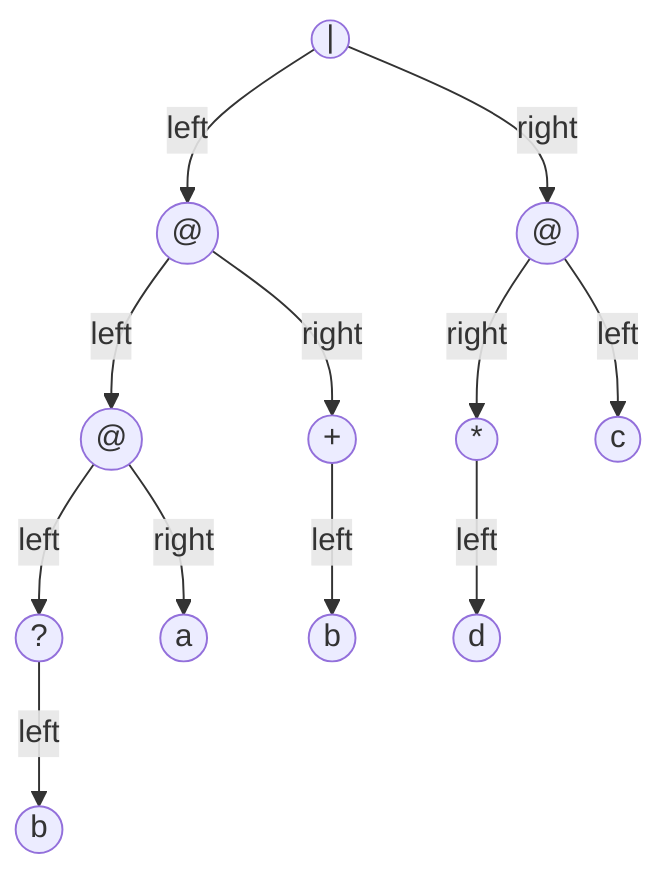
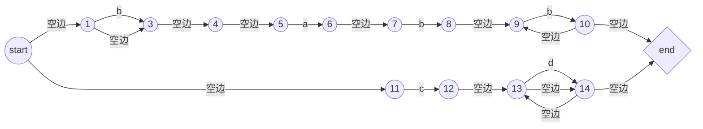
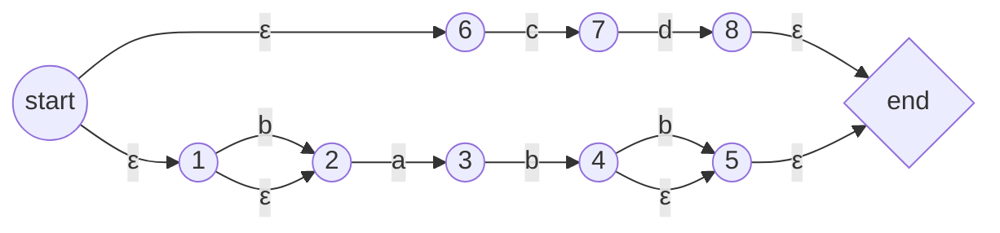
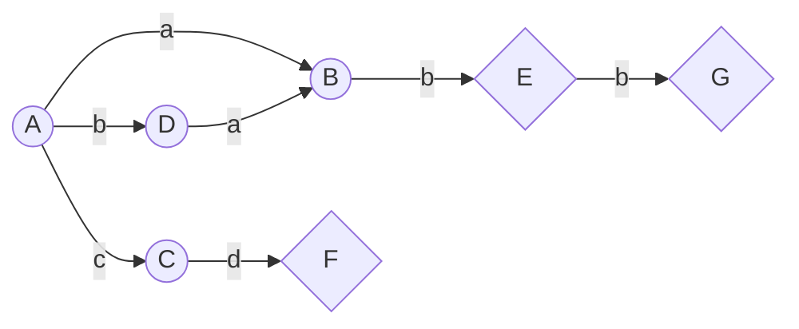
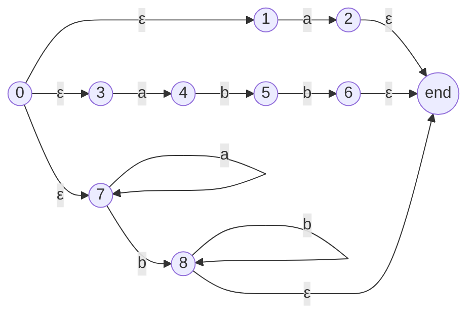
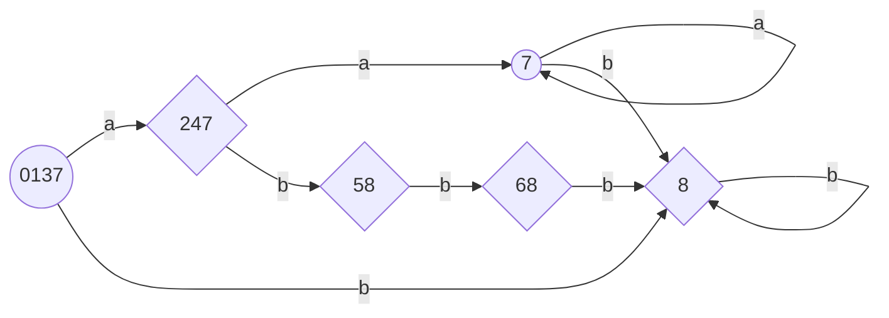

<center><h1>正则表达式解析算法详解

<center>KimanYang
    <center>jinmanyang2016@gmail.com

## 概述与背景知识

本文将详细描述一个简单的正则引擎所需的所有算法，包括:


- 递归下降分析，构造正则表达式的*抽象词法解析树*

- McMaughton-Yamada-Thompson算法，实现*正则结构词法树转换成$NFA$*
- 前文讲述过的*$NFA$到$DFA$转换*进一步扩充，采用子集构造法
- 我们之前一笔带过的消除重复状态的Hopcrpft算法，也可称为$DFA$到$MDFA$的转换

在开始讲解这些算法之前，先定义一下在这个系列中所使用的正则表达式类型为**纯正则表达式**，所描述的语法并不会超过乔姆斯基三型文法（正规文法）的表示范围。对扩展正则表达式不做要求。首先给出我们的正则表达式的扩展巴克斯范式文法表示，一个表达式由可选的多个“项(term)”并联而成，每个项由可选的多个因子(factor)(一般因子和重复*、多次重复+、可选?)构成，每个因子由字符(char)或者被括号括起来的表达式构成。

```
expr ::= term("|"term)*
term ::= factor*
factor ::= (subfactor|subfactor ("*"|"+"|"?"))
subfactor ::= char | "(" expr ")"
```

为了更好地理解构造解析器的过程，这里没有引入过多的`token`，demo版本功能局限于匹配`Ascii`码表示范围内的非保留字符(左右小括号、星号、加号、问号)的正则表达式，很容易在这基础上进行扩充。

最后在开始之前，我们给出关于$NFA$和$DFA$在集合论基础上的形式化定义，这些定义有助于我们更好地理解算法，当然只要理解*非确定*与*确定*的区别在于后继转移状态是否唯一也完全足够了。

- **NFA（非确定有限状态自动机）**：$N=(S,\Sigma,\delta,s_0,F)$
  - $S$——有限的状态集合
  - $\Sigma$——输入字母表，输入符号集合(假设空边$\epsilon$不在$\Sigma$中)
  - $\delta$——转换映射，$\delta:S\times\Sigma\to 2^S$。具体来说$\forall s\in S,a\in\Sigma,\delta(s,a)\sube S$，表示了从$s$出发沿着边$a$所能够到达的**状态集合**
  - $s_0$——开始状态，$s_0\in S$，有且仅有一个
  - $F$——终止状态集合，$F\sube S$
- **DFA（确定有限状态自动机）**：$D=(S,\Sigma,\delta,s_0,F)$
  - $S$——有限的状态集合
  - $\Sigma$——输入字母表，输入符号集合(假设空边$\epsilon$不在$\Sigma$中)
  - $\delta$——转换函数，$\delta:S\times\Sigma\to S$。具体来说$\forall s\in S,a\in\Sigma,\delta(s,a)\in S$，表示了从$s$出发沿着边$a$所能够到达的**唯一状态**
  - $s_0$——开始状态，$s_0\in S$，有且仅有一个
  - $F$——终止状态集合，$F\sube S$

## 递归下降分析

我们以一个简单的正则表达式串为例讲解递归下降分析算法，我们这里采用自顶向下的最左推导方法。

给定正则表达式`b?(ab+)|cd*`，用$@$表示规则的串联，则可以获得如下的词法解析树：



接下来我们可以设计一个递归算法的雏形来表示递归下降构造树的过程，伪代码如下:

```C++
token parse_expr();
token parse_term();
token parse_factor();
token parse_char();

/**文法 expr ::= term("|"term)* 的解析过程
   例如  term1 | temr2 | term3 的树为
            expr(alt2(|))
              /    \
            alt1(|)  term3
		    /  \ 
       term1 term2
**/
token parse_expr() {
    t = parse_term();
    while(cur_char == '|') {
        cur_char = get_next_char();
        p = parse_term();
        alt = new Tree_node_with_child_t_and_p();
        t = alt;
    }
    return t;
}

/**文法 term ::= factor+ 的解析过程
   例如 f1f2f3的树为(其中f1 f2 f3指三个factor)
   				+
   			   / \
   			  +	  f3
   			 / \
   			f1  f2 
**/
token parse_term() {
    t = parse_factor();
    while(currentChar == '(' || inalphabet(cur_char)) {
        cur_char = get_next_char();
        p = parse_factor();
        concat = new Tree_node_with_concat_child_t_and_p();
        t = concat;
    }
    return t;
}
/**文法 factor ::= (subfactor|subfactor ("*"|"+"|"?")) 的解析过程
	例如： a+ b? c* d的语法树分别为：
	  oneMore    option  closure  d
	  /			/		 /
	 a		   b		c
**/
token parse_factor() {
    t = parse_subfactor();
    while(cur_char == '*' || cur_char == '+' || cur_char == '?') {
        cur_char = get_next_char();
        case '*': subtype = new Tree_node_with_closure_and_child_t();
        case '+': subtype = new Tree_node_with_oneMore_and_child_t();
        case '?': subtype = new Tree_node_with_option_and_child_t();
        t =subtype;
    }
    return t;
}
/**文法 subfactor ::= char | "(" expr ")" 的解析过程
	此处要么得到单个字符作为token返回，要么直接回到开始的表达式解析
**/
token parse_subfactor() {
    t = nullptr;
    if(cur_char == '(') {
        cur_char = get_next_char();
        t = parse_expr();
        cur_char = get_next_char();//这里忽略左右括号，并不单独给予token
    } else {
        t = new Tree_node_with_char_nochild();
        cur_char = get_next_char(); //叶子节点可以跳过解析下一字符
    }
    return t;
}
```

这样我们手写的分析器就将所有的token都获取下来了，正式代码需要注意一下递归边界条件，在了解整个流程之后我们再定义一下所有的token类型：

```C++
enum TokenType {
    CHAR,	//字符
    ALTER,	// '|'连接符
    CONCAT, //代表factor之间的连接关系，图中以'@'表示
    KLEEN,  //克林闭包，即符号'*'
    OPTION, //可选关系，即符号'?'
    P_KLEEN, //一个以上匹配的克林闭包，即符号'+'
}
```

## Thompson算法

现在我们已经将正则表达式字符串转换为一颗抽象语法解析树（AST）了，下面介绍通过Thompson算法将解析树转换为一个$\epsilon-NFA$。该算法是语法制导的，也就是说它沿着正则表达式的语法解析树自底向上递归地进行处理，对于每一个子表达式，该算法构造一个只有一个接收状态的$NFA$。再前一篇文章中有提到过这种构造法，现在我们详细复习一遍并给出伪代码实现。

### 基本规则

1. 对于空边，构造如下$NFA$:

   ```mermaid
   graph LR;
   st((start));
   en{end};
   st -- 空边 --> en;
   ```

   

2. 对于字符集子表达式构造如下$NFA$：

   ```mermaid
   graph LR;
   st((start));
   en{end};
   st -- 字符集 --> en;
   ```

### 归纳规则

1. 规则的串联

   ```mermaid
   graph LR;
   st1((start));
   en1{end};
   st2((start));
   en2{end};
   st1 -- 子状态1 --> en1;
   en1 -- 空边 --> st2;
   st2 -- 子状态2 --> en2;
   ```

   

2. 规则的并联

   ```mermaid
   graph LR;
   st((start));
   en{end};
   st1((start));
   en1{end};
   st2((start));
   en2{end};
   st3((start));
   en3{end};
   st -- 空边 --> st1;
   st -- 空边 --> st2;
   st -- 空边 --> st3;
   st1 --子状态1 -->en1;
   st2 --子状态2 -->en2;
   st3 --子状态3 -->en3;
   en1 --空边-->en;
   en2 --空边-->en;
   en3 --空边-->en;
   ```

   

3. 规则的克林闭包

   ```mermaid
   graph LR;
   st((start));
   en{end};
   st --子状态--> en;
   en --空边 -->st;
   ```

### 实例分析

采用我们在递归下降分析中使用的例子`b?(ab+)|cd*`以及现成的语法分析树：

```
			|
		   / \
		  @   @
		 / \ / \
		@  + c  *
       / \ /    /
      ?  a b   d
     / 
    b
```

通过后序遍历可以逐步构造出我们所需要的每一个状态，在对每一个子树的规则实施规纳规则时首先把子树规则的开始和结束状态转为普通状态。

- 遍历到`b`，对应着一个基本规则即接受`b`的规则
- 再到`?`，对应着串联一个左子树规则(接受`b`的规则)再并联一个空边的基本规则
- 再到`a`，对应这一个基本规则即接受`a`的规则
- 再到`@`符号，对应将左子树的规则和右子树的规则串联
- 再到`b`，对应着一个基本规则即接受`b`的规则
- 再到`+`，对应着左子树规则(接受`b`的规则)串联一个左子树(接受`b`的规则)规则的克林闭包
- 再到`@`，对应着左子树规则和右子树规则串联
- 再到`c`，对应着一个基本规则即接受`c`的规则
- 再到`d`，对应着一个基本规则即接受`d`的规则
- 再到`*`，对应着左子树规则(接受`d`的规则)的克林闭包
- 再到`@`，对应着左子树规则和右子树规则串联
- 最后来到根节点`|`，对应着左子树规则和右子树规则的并联

通过上述算法我们构造出了一个含有大量冗余状态和空边的$NFA$，具体的状态机形式如下图所示：



可以发现串联操作形成了大量的空边，在这里我们可以初步将这些串联操作引起空边相邻状态合并来消除空边而不影响状态机的正确性。

## 子集构造法

在前一篇博文中我们介绍了如何消除空边的算法，但是并不能保证获得的不带空边的状态机一定会成为确定的状态机。下面先从理论上介绍完全消除$NFA$不确定性的完整的子集构造法(subset construction)，再对上述例子实施子集构造法。

### 算法理论

我们规定输入的非确定有限状态自动机是$N$，最终输出的确定有限状态自动机是$D$，通过子集构造法，$D$中的每一个状态最终会是$N$中的状态的集合。首先我们定义三种在$N$上的操作，规定$N$的状态集合为$S_N$，设$s\in S_N$而$T\sube S$，三种操作为：

1. $\epsilon-closure(s)$，指从状态$s$开始只通过空边$\epsilon$所能够到达的$N$上状态集合
2. $\epsilon-closure(T)$，指从集合$T$中某个状态开始只通过空边$\epsilon$所能够到达的$N$上状态集合，即$\cup_{s\in T}\epsilon-closure(s)$
3. $move(T,a)$，指从集合$T$中某个状态开始通过$a$的边能够到达的$N$上状态集合(**不能走空边**)

算法的流程如下：


其中$Dstates$指的是根据子集构造法最终能够构造出来的状态集。开始前将初始状态的$\epsilon-closure$加入状态集合。随后进行归纳的广度优先搜索，将经由$a$能够到达的状态集合的$\epsilon-closure$作为$D$的一个状态并不加标记，直到最终$Dstates$的所有状态都是被标记的。

### 实例分析

示例给出正则表达式`b?abb?|cd`由Thompson算法得到的非确定有限状态自动机：



对于上述的状态机模型我们采用子集构造法，首先定义字符集和状态转换表，可以看出状态总共有10个，字符集$\Sigma = \{a,b,c,d\}$，于是有如下的状态转换表（一个状态的$\epsilon-closure$包括其自身）：

|       | $\epsilon$ | a            | b            | c            | d            |
| ----- | ---------- | ------------ | ------------ | ------------ | ------------ |
| start | {st,1,2,6} | {3}          | {2}          | {7}          | $\emptyset $ |
| 状态1 | {1,2}      | {3}          | {2}          | $\emptyset $ | $\emptyset $ |
| 状态2 | {2}        | {3}          | $\emptyset $ | $\emptyset $ | $\emptyset $ |
| 状态3 | {3}        | $\emptyset $ | {4}          | $\emptyset $ | $\emptyset $ |
| 状态4 | {4,5,end}  | $\emptyset $ | {5}          | $\emptyset $ | $\emptyset $ |
| 状态5 | {5,end}    | $\emptyset $ | $\emptyset $ | $\emptyset $ | $\emptyset $ |
| 状态6 | {6}        | $\emptyset $ | $\emptyset $ | {7}          | $\emptyset $ |
| 状态7 | {7}        | $\emptyset $ | $\emptyset $ | $\emptyset $ | {8}          |
| 状态8 | {8,end}    | $\emptyset $ | $\emptyset $ | $\emptyset $ | $\emptyset $ |
| end   | {end}      | $\emptyset $ | $\emptyset $ | $\emptyset $ | $\emptyset $ |

开始时刻我们的$Dstates=\{\epsilon-closure(s_0)\}=\{\{st,1,2,6\}\}$，集合下标tag表示被标记

- 标记初始的$DFA$状态，遍历字符集，
  - 查表状态{st, 1，2，6}经由$a$可达状态的$\epsilon-closure$有{3}，于是将{3}不加标记加入状态集合中，同时将边{st, 1,2,6}经由a到{3}加入$DFA$转换函数
  - 查表状态{st, 1，2，6}经由$b$可达状态的$\epsilon-closure$有{2}，于是将{2}不加标记加入状态集合中，直接将边{st, 1,2,6}经由b到{2}加入$DFA$转换函数
  - 查表状态{st, 1，2，6}经由$c$可达状态的$\epsilon-closure$有{7}，于是将{7}不加标记加入状态集合中，同时将边{st, 1,2,6}经由c到{7}加入$DFA$转换函数
  - 查表状态{st, 1，2，6}经由d可达状态啥也没有
- 此时我们的$Dstates = \{ \{st,1,2,6\}_{tag} \{3\} \{2\} \{7\} \}$，取出状态{3}，遍历字符集
  - 查表状态{3}经由a/c/d啥也到达不了，经由b可以到达的状态的$\epsilon-closure$有{4，5，end}，于是将{4,5,end}不加标记加入状态集合中，同时将边{3}经由b到{4,5,end}加入$DFA$转换函数
- 此时我们的$Dstates = \{ \{st,1,2,6\}_{tag} \{3\}_{tag}\{ 2\} \{7\} \{4,5,end\} \}$，取出状态{7}，遍历字符集
  - 查表状态{7}经由a/b/c啥也到达不了，经由b可以到达的状态的$\epsilon-closure$有{end,8}，于是将{end,8}不加标记加入状态集合中，同时将边{7}经由d到{end,8}加入$DFA$转换函数
- 此时我们的$Dstates = \{ \{st,1,2,6\}_{tag} \{3\}_{tag} \{7\}_{tag} \{2\} \{4,5,end\} \{end,8\} \}$，取出状态{2},遍历字符集
  - 状态2经由b/c/d啥也到达不了，经由a到达的{3}已经在集合中了，于是将{2}经由a到达{3}加入$DFA$转换函数
- 此时我们的$Dstates = \{ \{st,1,2,6\}_{tag} \{3\}_{tag} \{7\}_{tag} \{2\}_{tag} \{4,5,end\} \{end,8\} \}$，取出状态{4,5,end}，遍历字符集
  - 查表状态{4,5,end}经由a/c/d啥也到达不了，经由b到达的$\epsilon-closure${5,end}，于是将{5,end}不加标记地加入状态集合中，同时将边{4,5,end}经由b到{5,end}加入$DFA$转换函数
- 此时我们的$Dstates = \{ \{st,1,2,6\}_{tag} \{3\}_{tag} \{7\}_{tag} \{2\}_{tag} \{4,5,end\}_{tag} \{end,8\} \{5,end\} \}$，取出状态{end,8}遍历字符集，所得的{end,8}已在集合中，没有可得状态
- 此时我们的$Dstates = \{ \{st,1,2,6\}_{tag} \{3\}_{tag} \{7\}_{tag} \{2\}_{tag} \{4,5,end\}_{tag} \{end,8\}_{tag} \{5,end\} \}$，取出最后一个状态{5,end}，遍历字符集，所得的{end,5}已在集合中，没有可得状态

至此算法结束，我们得到了一个$DFA$状态集合$Dstates = \{ \{st,1,2,6\}_{tag} \{3\}_{tag} \{7\}_{tag} \{2\}_{tag} \{4,5,end\}_{tag} \{end,8\}_{tag} \{5,end\}_{tag} \}$，以及它们对应的边和转换函数，在算法执行过程中我们可以直接将含有$end$状态的新状态标记为$DFA$的终止状态，让我们重新命名这几个状态并将其转换函数表展现出来：

| $NFA$状态  | $DFA$状态 | a            | b            | c            | d            |
| ---------- | --------- | ------------ | ------------ | ------------ | ------------ |
| {st,1,2,6} | A         | B            | D            | C            | $\emptyset $ |
| {3}        | B         | $\emptyset $ | E            | $\emptyset $ | $\emptyset $ |
| {7}        | C         | $\emptyset $ | $\emptyset $ | $\emptyset $ | F            |
| {2}        | D         | B            | $\emptyset $ | $\emptyset $ | $\emptyset $ |
| {4,5,end}  | E         | $\emptyset $ | G            | $\emptyset $ | $\emptyset $ |
| {end,8}    | F         | $\emptyset $ | $\emptyset $ | $\emptyset $ | $\emptyset $ |
| {5,end}    | G         | $\emptyset $ | $\emptyset $ | $\emptyset $ | $\emptyset $ |

根据上述的状态转换表得到下面的`b?abb?|cd`对应$DFA$图:



子集构造法在其自身运行的过程中已经完成了我们在第一篇博客中所说的的消除空边的要求以及消除不确定性的要求，因此也不需要额外运行消除空边的算法了，但单纯消除空边并模拟$NFA$带回溯来验证正则表达式在某些场景下效率可能并不低，所以先前所说的算法也存在应用场景。具体可以参考3.7.5节的$DFA$和$NFA$效率的分析，对于构建高效的正则引擎或者不同场景下的正则引擎优化很有帮助。

在这里额外说明一下，存在算法可以直接通过正则表达式的语法分析树获得其对应$DFA$，可以参考《编译原理》第二版（即大家都很熟悉的龙书）的3.9.2节内容。

## Hopcrpft算法

该算法用于最小化一个$DFA$的状态数，正如我们在前一篇博文中所描述的解析C语言数字的正则表达式可以有

1. `([+-]?\\d+)|([+-]?((\\d+\\.)|(\\d+\\.\\d+)|(\\.\\d+)))([eE][+-]?)\\d+`
2. `([+-]?(\\d+(\\.\\d*)?|(\\.\\d+)))([eE][+-]?\\d+)?`

两种，显然第二种更短，两个正则表达式对应的$DFA$也很可能是不同的。进一步地，我们在做题求解自动机的过程中已经发现了存在一些相同的状态可以进行化简，Hopcrpft算法可以在$O(n\log n)$的时间复杂度以内做到这件事。下面我们就介绍与化简$DFA$相关的理论知识。

### 算法理论

不加证明地给出一个结论：任何正则语言都有一个唯一的（不计同构）状态数目最小的$DFA$，而且从任意一个接受相同语言的$DFA$出发，通过分组合并等价的状态，我们总是可以构建得到状态数目最小的$DFA$。

首先定义在$DFA$中两个状态什么情况下是**可区分**的，这对于我们理解什么状态可以进行合并十分有帮助。

- **可区分性**：如果我们从两个状态$s$和$t$出发，沿着标号为$x$的路径到达了两个状态，这两个状态之中只有一个是终止状态，那么我们称这个串$x$能够区分状态$s$和$t$。如果对于两个状态$s$和$t$存在这样的串，那么这两个状态就是可区分的。
- 显然一个空串$\epsilon$能够区分非终止状态和非终止状态

我们的算法所要做到的事情是将一个$DFA$中的状态进行分组，组内的状态不可相互区分，将整个组作为最小$DFA$的一个状态。算法大致思想如下：

**输入：**$DFA$ ，$D=(S,\Sigma,\delta,s_0,F)$

**输出：**$DFA$，$D^{'} = (S^{'},\Sigma,\delta^{'},s_0^{'},F^{'})$，和$D$接收相同的语言且状态数最小

初始时刻，我们将$D$中的状态分为两个组，分别为非接受组$S-F$（包含所有非终止状态）和接受组$F$（包含所有终止状态）。从我们的当前划分出的组中选择一个状态组$A$，选定某个输入符号$a$检查是否可以用于区分状态组中的某些状态，对于能够区分的我们就划分为多个组使得组内的状态在$a$作用下都到达相同的状态。重复上述分割过程直到无法继续分割。我们把某一步的算法得到的分割方法定义为$\prod_{new}$，初始划分$\{ \{F\},\{S-F\}\} $为定义为$\prod$。算法完成时的分割方法定义为$\prod_{final}$。下面给出算法流程：

1. 如先前所说划分两个组接受组$F$和非接受组$S-F$作为初始划分

2. 如下图所示进行划分构造

   

3. 如果$\prod_{new}=\prod$则直接令$\prod_{final}=\prod$；否则用$\prod_{new}$替换$\prod$并重复步骤2。

4. 在分划出的$\prod_{final}$的每个组选定一个状态作为该组的代表，这些代表构成了$D^{'}$的状态，对于这些状态：

   1. $D^{'}$的开始状态是包含了$D$开始状态的组
   2. $D^{'}$的终止状态是包含了$D$终止状态的组
   3. 令$s$是$\prod_{final}$中某个组$G$的代表，并令$D$中在输入$a$上离开$s$的转换到达状态$t$。令$r$为$t$所在组$H$的代表，那么在$D^{'}$中存在一个从$s$到$r$在输入$a$上的转换。

有两个要点需要注意：

- 状态最小化的原理：要使得算法成立且最终得到的结果是最小化的，我们不做证明给出两个性质：
  - 仍然位于$\prod_{final}$的同一组状态不可能被任意串区分
  - 不同子组之间的状态时可区分的
- 死状态的消除：最小化算法可能产生带有所有输入符号上都指向自己的非接受状态，这种状态可能使得识别无法提早退出，被称为死状态


### 实例分析

考虑正则表达式`a|abb|a*b+`，通过Thompson算法获得的$NFA$形式为：



经过子集构造法可以获得如下的$DFA$:



对于上图的$DFA$，其初始划分为：{0137,7} {247,8,58,68}，对于每个组内的状态，我们遍历字母表$a$和$b$，出现不同的状态就区分，经过多次迭代可以得到最终的区分。